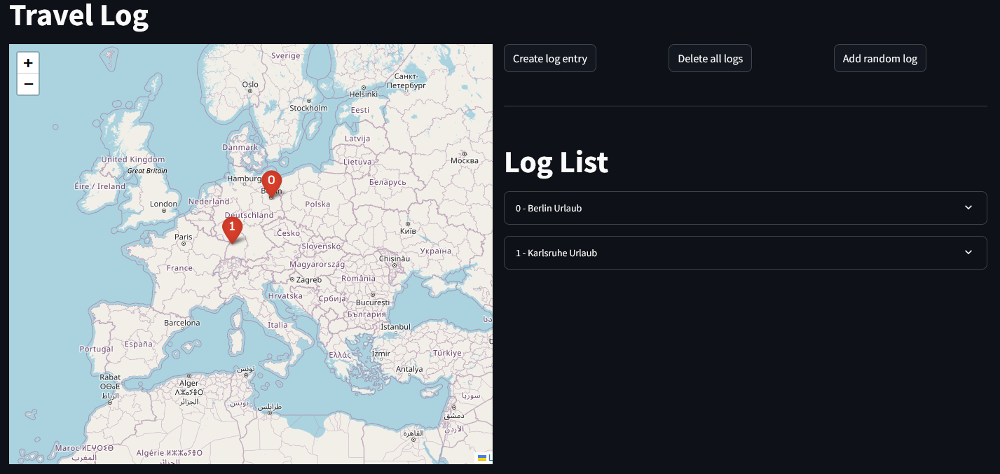

# Projekt-Arbeit-Streamlit
Diese Arbeit wurde im Rahmen der Projektarbeit mit dem Titel "Webentwicklung mit Streamlit und Python" im Wintersemester 24/25 an der Hochschule Karlsruhe erstellt. 

# Stack
- streamlit.io https://docs.streamlit.io/
- pixi https://pixi.sh/latest/basic_usage/
- streamlit-folium https://folium.streamlit.app/
- pickle https://docs.python.org/3/library/pickle.html

# Setup & Ausführung
Für die Installation wird pixi von prefix dev benötigt (siehe Stack).
- Installieren der Dependencies mit: `pixi install`
- Ausführen mit VSCode launch configs oder mit: `pixi run streamlit run travel_log.py`
- Streamlit Installation prüfen mit: `pixi run streamlit hello`
# Datenspeicherung
Der aktuelle Zustand der App (Inhalt der Log list) wird als Datei mithilfe der pickle library gespeichert. Bei einem Neustart wird der letzte Stand aus der Datei ausgelesen.
# Travel Log
Travel Log ist eine App zur Erstellung eines Logbuches von Reisen. Dieses Logbuch kann nicht nur Text-Einträge speichern, sondern auch Bilder sowie die Position auf einer Karte.

__Benutzeroberfläche__

Auf der linken Seite der Benutzeroberfläche wird die Karte angezeigt, diese zeigt je Log Eintrag einen nummerierten Marker an. Auf der rechten Seite sieht man die Buttons zum Erstellen neuer Einträge, zum Löschen aller Einträge und zum Erstellen eines zufälligen Eintrags. Darunter sieht man die Log List, diese hat je Log Eintrag eine auffaltbare Kachel. Im nicht aufgefalteten Zustand wird die Nummer sowie der Titel angezeigt. Die Nummer des Eintrags entspricht der Nummer der Marker auf der Karte, sodass man die Marker den Einträgen zuordnen kann.

__Log List__

Die Log List zeigt wie bereits erwähnt je Log Eintrag eine aufklappbare Kachel an. Wird die Kachel aufgeklappt, so werden alle Informationen zu diesem Log Eintrag angezeigt wie z.b. das Bild oder die Beschreibung. Zudem befindet sich am unteren Ende der aufgeklappten Kachel der Button zum Editieren des Eintrags.

__Neuen Eintrag erstellen__

Möchte der Anwender einen neuen Eintrag erstellen, kann er den Create log entry Button drücken. Sobald er dies tut, erscheinen zwei Eingabefelder zum Eingeben des Namens so wie einer Beschreibung. Zusätzlich hat der Anwender die Möglichkeit auf die Karte zu klicken um den Marker zu platzieren, dieser erscheint dann zunächst als blauer Marker auf der Karte. Bestätigt der Anwender das Erstellen mit dem Confirm create button, dann wird der Eintrag ins log gespeichert und wird in der Log List angezeigt. Alternativ kann er mit Cancel das Anlegen abbrechen. 

__Eintrag Bearbeiten__

Zum Bearbeiten von bestehenden Einträgen hat jeder Eintrag in der Log List einen Edit Button. Drückt man diesen, erscheint ein modaler Dialog zum Bearbeiten des Eintrags. In diesem kann der Name, die Beschreibung, eine Adresse sowie die Koordinaten des Markers bearbeitet werden. Zusätzlich kann auch noch ein Bild hochgeladen werden. Um die Änderungen zu Speichern muss der Submit Button gedrückt werden.

# Fazit zu Streamlit
Positiv:
- Anlegen einer neuen App ist sehr einfach und unproblematisch
- Einfaches anzeigen von Markdown
- layouts Konzept simpel und praktisch
- keine tiefen Pythonkenntnisse notwendig

Negativ:
- State Konzept ist schwierig zu verstehen
- Konzept bei welchen Aktionen der Python code erneut ausgeführt wird führt anfangs zu Verwirrung
- Standard Komponenten teilweise nicht sehr umfangreich, z.b. können st.expander nicht verschachtelt werden
- Beim dynamisches erstellen von Elementen dürfen zwei Elemente nicht denselben Namen haben